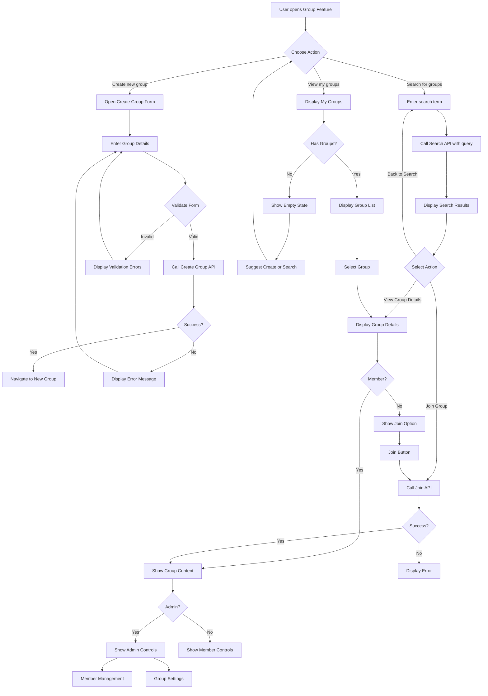

```mermaid
flowchart TD
    %% Group Search Flow
    A[User opens Group Feature] --> B{Choose Action}
    B -->|Search for groups| C[Enter search term]
    B -->|Create new group| G[Open Create Group Form]
    B -->|View my groups| H[Display My Groups]
    
    C --> D[Call Search API with query]
    D --> E[Display Search Results]
    E --> F{Select Action}
    F -->|View Group Details| I[Display Group Details]
    F -->|Join Group| J[Call Join API]
    F -->|Back to Search| C
    
    %% Group Creation Flow
    G --> K[Enter Group Details]
    K --> L{Validate Form}
    L -->|Invalid| M[Display Validation Errors]
    M --> K
    L -->|Valid| N[Call Create Group API]
    N --> O{Success?}
    O -->|Yes| P[Navigate to New Group]
    O -->|No| Q[Display Error Message]
    Q --> K
    
    %% Group Details Flow
    I --> R{Member?}
    R -->|Yes| S[Show Group Content]
    R -->|No| T[Show Join Option]
    
    S --> U{Admin?}
    U -->|Yes| V[Show Admin Controls]
    U -->|No| W[Show Member Controls]
    
    V --> X[Member Management]
    V --> Y[Group Settings]
    
    T --> Z[Join Button]
    Z --> J
    J --> AA{Success?}
    AA -->|Yes| S
    AA -->|No| AB[Display Error]
    
    %% My Groups Flow
    H --> AC{Has Groups?}
    AC -->|Yes| AD[Display Group List]
    AC -->|No| AE[Show Empty State]
    AE --> AF[Suggest Create or Search]
    AF --> B
    
    AD --> AG[Select Group]
    AG --> I
```